# Data model

**GitHub and many Markdown previews shrink wide images to the column width.** For readable views, open the raw SVG and scroll/zoom:

- **[Full schema (all tables & relations)](./data-model-full-erd.svg)** — authoritative.
- **[Core slice](./data-model-erd.svg)** — **User**, **Event**, **EventMember**, and every table not delegated to a domain slice below.
- **[Packing slice](./packing-data-model-erd.svg)**
- **[Rides slice](./rides-data-model-erd.svg)**
- **[Tasks slice](./tasks-data-model-erd.svg)**
- **[Notifications slice](./notifications-data-model-erd.svg)**

## Full model (embedded)

## Core slice (embedded)

## Packing slice (embedded)

## Rides slice (embedded)

## Tasks slice (embedded)

## Notifications slice (embedded)

